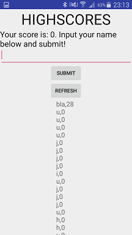
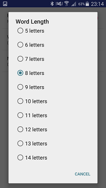

Design document
==================
Kubilay Keser 10610286 <zkkeser@gmail.com>
------------------
Design choices
------------------
While designing the settings activity I started thinking about the implemenation of the slider. The usefulness of a slidebar depends on its function.
When using it to set a volume it's great, because the exact number you want to set for the volume isn't relevant. Using a slidebar gets troublesome the moment
one wants to use it so pick out precise numbers. This can be especially difficult when the range is large. This is why chose not to implement a slidebar.

UX
-------------------

Screenshots
-------------------

Model
-------------------
